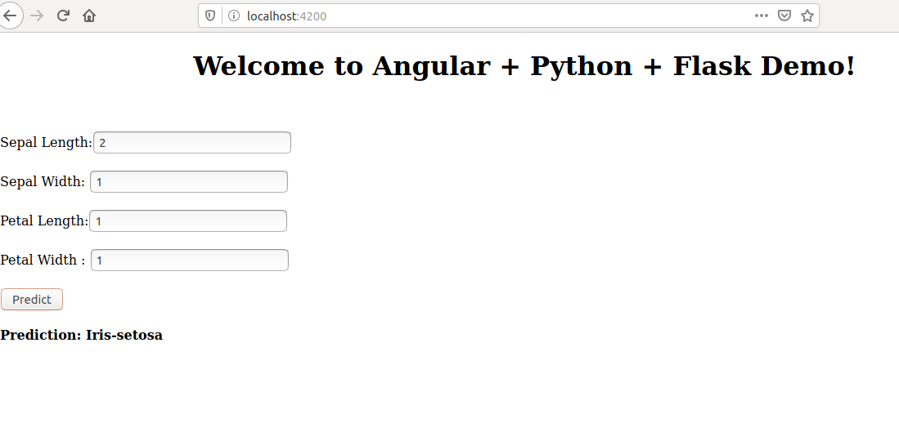

<h2>Run Your Machine Learning Model as a REST API using jupyterLab
</h2>


#### Pre-reqs:
- Google Chrome (Recommended)

#### Lab Environment
Notebooks are ready to run. All packages have been installed. There is no requirement for any setup.

**Note:** Elev8ed Notebooks (powered by Jupyter) will be accessible at the port given to you by your instructor. Password for jupyterLab : `1234`

You can access jupyter lab at `<host-ip>:<port>/lab/workspaces/lab1_MachineLearning_Rest_API`


There should be two terminals opened already. Run following command in these terminals:

**Terminal 1:** `cd ~/work/python-minicourses/Machine-Learning-REST-API/ML_REST` 

**Terminal 2:** `cd ~/work/python-minicourses/Machine-Learning-REST-API/RestClientAngular` 


<h2>****  PART1 ****</h2>
 <h3>Machine Learning Model using REST API using FLASK</h3>

<h4>Step 1 </h4>
create the following directory structure:

ML-Deploy

* model / Train.py
* app.py

<h4>Step 2</h4>

First we need to install following libraries (Python 3) using pip3(or pip in some cases) command

```
pip3 install -U scikit-learn scipy matplotlib
pip3 install Flask
pip3 install Flask-RESTful
pip3 install -U flask-cors

```

That went well? Good. Let’s dive into some good stuff now.

<h4>Step 3</h4>

<h5>Making a Basic Prediction Script</h5>

If you are following along with the directory structure, you should open up the model/Train.py file now. The goal is to load in the Iris dataset and use a simple Decision Tree Classifier to train the model. we will use joblib library to save the model once the training is complete, and we will also report the accuracy score back to the user.
 Here’s the whole script:

```
from sklearn import datasets
from sklearn.tree import DecisionTreeClassifier
from sklearn.model_selection import train_test_split
from sklearn.metrics import accuracy_score
from sklearn.externals import joblib


def train_model():
    iris_df = datasets.load_iris()

    x = iris_df.data
    y = iris_df.target

    X_train, X_test, y_train, y_test = train_test_split(x, y, test_size=0.25)
    dt = DecisionTreeClassifier().fit(X_train, y_train)
    preds = dt.predict(X_test)

    accuracy = accuracy_score(y_test, preds)
    joblib.dump(dt, 'iris-model.model')
    print('Model Training Finished.\n\tAccuracy obtained: {}'.format(accuracy))
    
 ```
 So this it all for our Train model. You can add more model or create any model here and add to flask server (you will see in next step) and call it from frontend GUI
 
<h4>Step 4</h4>

<h5>Creating Flask app to deploy our train model</h5>

Now you’re ready to open the app.py file and do some imports. You’ll need the os module, a couple of things from Flask and Flask-RESTful, the model training script created 10 seconds ago, and the joblib to load in the trained model:
```
from flask import Flask, request,jsonify
from flask_cors import CORS, cross_origin
from flask_restful import Resource, Api
from json import dumps
from model.Train import train_model
from sklearn.externals import joblib
import os
```
Now you should make an instance of Flask and Api from Flask-RESTful.

```
app = Flask(__name__)
api = Api(app)
CORS(app)
```

`CORS(app)` is a Flask extension for handling Cross Origin Resource Sharing (CORS), making cross-origin AJAX possible. This package has a simple philosophy, when you want to enable CORS, you wish to enable it for all use cases on a domain. This means no mucking around with different allowed headers, methods, etc.

The next thing to do is to check whether the model is already trained or not. In the Train.py you’ve declared that the model will be saved in the file iris-model.model, and if that file doesn’t exist, the model should be trained first. Once trained, you can load it in via joblib:
```
if not os.path.isfile('iris-model.model'):
    train_model()

model = joblib.load('iris-model.model')
```
Now you’ll need to declare a class for making predictions. Flask-RESTful uses this coding convention, so your class will need to inherit from the Flask-RESTful Resource module. Inside the class, you can declare get(), post(), or any other method for handling data.
We’ll use post(), so the data isn’t passed directly through the URL. You’ll need to fetch attributes from the user input (prediction is made based on attribute value the user has entered). Then, you can call .predict() function of the loaded model. Just because the target variable of this dataset is in the form `(0, 1, 2)` instead of `(‘Iris-setosa’, ‘Iris-versicolor’, ‘Iris-virginica’)`, you’ll also want to address that. Finally, you can return JSON representation of the prediction:
```
class MakePrediction(Resource):
    @staticmethod
    def post():
        posted_data = request.get_json()
        sepal_length = posted_data['sepal_length']
        sepal_width = posted_data['sepal_width']
        petal_length = posted_data['petal_length']
        petal_width = posted_data['petal_width']

        prediction = model.predict([[sepal_length, sepal_width, petal_length, petal_width]])[0]
        if prediction == 0:
            predicted_class = 'Iris-setosa'
        elif prediction == 1:
            predicted_class = 'Iris-versicolor'
        else:
            predicted_class = 'Iris-virginica'

        response = jsonify({
            'Prediction': predicted_class
        })
        response.headers.add('Access-Control-Allow-Origin', '*')
        return response
```   
Now let create simple method for root address . This will help us to check our flask  server if online or not 

```
@app.route("/")    
def hello():
    return jsonify({'text':'Hello World!'})
```

We’re almost there, so hang in tight! You’ll also need to declare a route, the part of URL which will be used to handle requests:

```
api.add_resource(MakePrediction, '/predict')
```
<h6>
 In this line we bind our endpoint `/predict` to our class `MakePrediction` (and in this class we define to tak post request)
So if you want to add new model then you have create new  EndPoint for new Model and add bind new class wih it like we did here 
 </h6>
 
And the final thing is to tell Python to run the app in debug mode:
 
```
if __name__ == '__main__':
    app.run('0.0.0.0', 5002, debug=True)
```    
And that’s it. You’re ready to launch the model and make predictions, either through Postman or some other tool.
Just in case you missed something, here’s the entire app.py file:
```
from flask import Flask, request,jsonify
from flask_cors import CORS, cross_origin
from flask_restful import Resource, Api
from json import dumps
from model.Train import train_model
from sklearn.externals import joblib
import os
app = Flask(__name__)
api = Api(app)
CORS(app)


if not os.path.isfile('iris-model.model'):
    train_model()

model = joblib.load('iris-model.model')


class MakePrediction(Resource):
    @staticmethod
    def post():
        posted_data = request.get_json()
        sepal_length = posted_data['sepal_length']
        sepal_width = posted_data['sepal_width']
        petal_length = posted_data['petal_length']
        petal_width = posted_data['petal_width']

        prediction = model.predict([[sepal_length, sepal_width, petal_length, petal_width]])[0]
        if prediction == 0:
            predicted_class = 'Iris-setosa'
        elif prediction == 1:
            predicted_class = 'Iris-versicolor'
        else:
            predicted_class = 'Iris-virginica'

        response = jsonify({
            'Prediction': predicted_class
        })
        response.headers.add('Access-Control-Allow-Origin', '*')
        return response
@app.route("/")    
def hello():
    return jsonify({'text':'Hello World!'})


api.add_resource(MakePrediction, '/predict')


if __name__ == '__main__':
    app.run('0.0.0.0', 5002, debug=True)
```    
Okay, are you ready?

<h4>Step 5</h4>
 Run the file `app.py` if no error occur open browser and navigate to `http://host-ip:5002/` and you will see 'Hello World!'.
   Now our server is online and listening to request.


First, create a file  `requirements.txt` to add all the librairies require for our app
Add the following text to newly created  `requirements.txt`

```
flask
flask-restful
scikit-learn
scipy 
matplotlib
flask-cors
```


   


   
  <h2>****  PART2 ****</h2>

<h2>REST API client GUI using angular</h2>
First we need to create a new angular project using following command in terminal to install angular and create new project 

<h4>Step 1</h4>

```
npm install -g @angular/cli
ng new RestClientAngularWeb
cd RestClientAngularWeb
ng serve
```
if everything works as expected then open browser and navigate to `http://<host-ip>:4200/` and you should see the default angular homepage


<h4>Step 2</h4>
Now open the project folder with the editor

Open the file `src/app/app.module.ts`
we need to import httpclient,FormsModule,ReactiveFormsModule
```
import { BrowserModule } from '@angular/platform-browser';
import { NgModule } from '@angular/core';
import { HttpClientModule } from '@angular/common/http';  //added line
import { AppComponent } from './app.component';
import { FormsModule,ReactiveFormsModule } from '@angular/forms';   //added line
@NgModule({
  declarations: [
    AppComponent
  ],
  imports: [
    BrowserModule,
    HttpClientModule, //added line
    FormsModule,  //added line
    ReactiveFormsModule  //added line
    ],
  providers: [],
  bootstrap: [AppComponent]
})
export class AppModule { }
```
<h4>Step 3</h4>
Now open the file  `src/app/app.component.ts`

and remove all the existing code and replace it with the following code 
```
import { Component } from '@angular/core';
import { HttpClient } from '@angular/common/http';
import {FormGroup } from '@angular/forms';


@Component({
  selector: 'app-root',
  templateUrl: './app.component.html',
  styleUrls: ['./app.component.css']
})
export class AppComponent {
  title = 'app';
  app: FormGroup;
  prediction:any;
  result:any;
  constructor(private httpClient: HttpClient) {
  }

  ngOnInit() {
  }


  onSubmit(formData) {
    console.log(formData);
    this.httpClient.post('http://127.0.0.1:5002/predict',
    formData).subscribe(data => {
      this.prediction = data as JSON;
      this.result=this.prediction.Prediction;
      console.log(this.prediction.Prediction);
    })
  }

}

```
here we created a method `onSubmit(formData)` which will take the JSON data from the form and post it to our flask server `(ENDPOINT predict)` and then get the the result and display on GUI. Basically in this step we are calling RESTFUL api.If we have any new Model then we just need to call its API in the similar way.
<h4>Step 4 </h4>
Now open the file  `src/app/app.component.html`

and remove all the code and replace with the following code 

```
<div style="text-align:center">
  <h1>
    Welcome to Angular + Python + Flask Demo!
  </h1>
</div>

<br>


<form #f="ngForm" (ngSubmit)="onSubmit(f.value)">
<br>
  <div>Sepal Length:<input type="text"     name="sepal_length" ngModel></div>
<br>
  <div>Sepal Width:&nbsp;<input type="text"     name="sepal_width"      ngModel></div>
<br>
  <div>Petal Length:<input type="text" name="petal_length" ngModel></div>
<br>
  <div>Petal Width :&nbsp;<input type="patextssword" name="petal_width"  ngModel></div>
<br>
  <button type="submit">Predict</button>
</form>
<br>
<div>
  
  <b><span>Prediction: {{result}}</span></b>
</div>

```
In this step we had created a form to take input from user and submit to call FLASK REST API .we can modify the form to take more input if  required by REST API
 
<h4>Step 5 </h4>

**Important**

- Make sure that flask server is up and running we disscussed in part 1.
- Also, update `RestClientAngularWeb\src\app\app.component.ts` line no **25** with `public-ip` on which jupyterLab is running. 
Use`localhost` if you running jupyterLab container locally. We will send rest call to flask api from the angular application.


Now run the command `ng serve --host 0.0.0.0` from terminal inside the angular project folder 
if everything works as expected then open browser and navigate to `http://host-ip:4200/` and you will see the homepage with form to enter the data for prediction and you result will be on bottom coming from REST server



