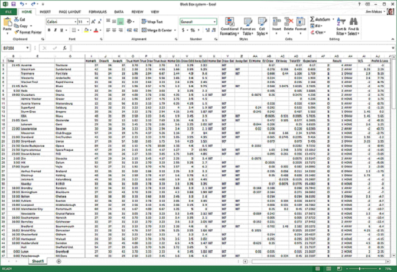

**How to Load Data in Python with Scikit-Learn**

Before you can build machine learning models, you need to load your data
into memory.

In this lab, you will discover how to load data for machine learning in
Python using
[scikit-learn](http://machinelearningmastery.com/a-gentle-introduction-to-scikit-learn-a-python-machine-learning-library/).

Discover how to prepare data with pandas, fit and evaluate models with
scikit-learn, and more [in my new
book](https://machinelearningmastery.com/machine-learning-with-python/),
with 16 step-by-step tutorials, 3 projects, and full python code.

Let’s get started.




**Packaged Datasets** 
---------------------

The scikit-learn library is [packaged with
datasets](http://scikit-learn.org/stable/datasets/). These datasets are
useful for getting a handle on a given machine learning algorithm or
library feature before using it in your own work.

This recipe demonstrates how to load the famous [Iris flowers
dataset](http://en.wikipedia.org/wiki/Iris_flower_data_set).

```
# Load the packaged iris flowers dataset
# Iris flower dataset (4x150, reals, multi-label classification)
iris = load_iris()
print(iris)
```

**Load from CSV** 
-----------------

It is very common for you to have a dataset as a CSV file on your local
workstation or on a remote server.

This recipe show you how to load a CSV file from a URL, in this case the
Pima Indians diabetes classification dataset.

You can learn more about the dataset here:

-   [Dataset
    File](https://raw.githubusercontent.com/jbrownlee/Datasets/master/pima-indians-diabetes.csv).

-   [Dataset
    Details](https://raw.githubusercontent.com/jbrownlee/Datasets/master/pima-indians-diabetes.names)

From the prepared X and y variables, you can train a machine learning
model.

```
# Load the Pima Indians diabetes dataset from CSV URL
import numpy as np
import urllib
# URL for the Pima Indians Diabetes dataset (UCI Machine Learning Repository)
url = "https://raw.githubusercontent.com/jbrownlee/Datasets/master/pima-indians-diabetes.data.csv"
# download the file
raw_data = urllib.urlopen(url)
# load the CSV file as a numpy matrix
dataset = np.loadtxt(raw_data, delimiter=",")
print(dataset.shape)
# separate the data from the target attributes
X = dataset[:,0:7]
y = dataset[:,8]
```

##### Run Notebook
Click notebook `12.ipynb` in jupterLab UI and run jupyter notebook.

**Summary** 
-----------

In this lab, you discovered that the scikit-learn method comes with
packaged data sets including the iris flowers dataset. These datasets
can be loaded easily and used for explore and experiment with different
machine learning models.

You also saw how you can load CSV data with scikit-learn. You learned a
way of opening CSV files from the web using the [urllib
library](https://docs.python.org/2/library/urllib.html) and how you can
read that data as a NumPy matrix for use in scikit-learn.